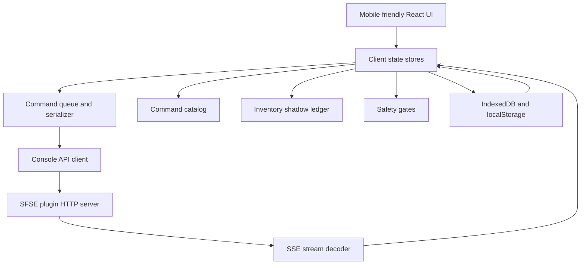
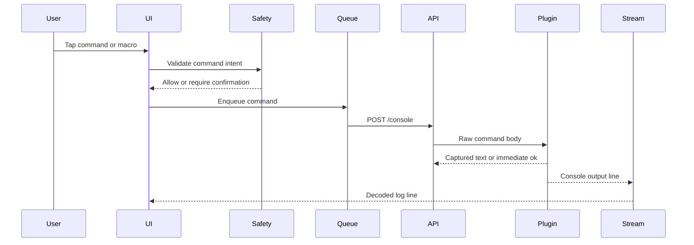
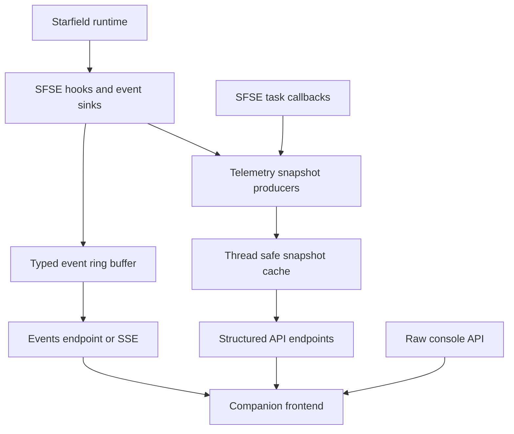

# Starfield Companion Web App Implementation Architecture Plan

## Purpose

Scaffold a mobile-friendly static companion web app inside this repository without changing the existing C++ SFSE plugin behavior. The first implementation should work against the plugin API that already exists:

- `POST /console?mode=command&timeout=N` with a raw console command body and captured text response.
- `POST /console?mode=stream` with a raw console command body and immediate return.
- `GET /stream` as an SSE stream where each `data:` payload is base64 encoded console output.
- Static file serving from `WebConsole.sStaticFilesPath` when web console hosting is enabled.

Native-hook features such as structured inventory snapshots, ship statistics, player form inspection, and typed game-state endpoints are deferred to a future plugin roadmap.

## Repository Findings

- The repository is currently a C++ SFSE plugin with Visual Studio project files and no frontend toolchain.
- The plugin already reads web hosting configuration from `Data\SFSE\plugins\sfse_plugin_console_api.ini` keys under `Plugin` and `WebConsole`.
- Static files are served by the plugin from `WebConsole.sStaticFilesPath`, defaulting to `Data\SFSE\plugins\sfse_plugin_console_api\`.
- The server maps `POST /console` and `GET /stream`, then falls back to static file serving when static files are enabled.
- The static file MIME map supports common PWA bundle assets such as `.html`, `.js`, `.css`, `.json`, `.svg`, `.png`, `.ico`, `.woff`, and `.woff2`.
- The current first scaffold can be implemented entirely as a static frontend bundle plus docs/config guidance.

## Recommended Frontend Stack

Use a lightweight static PWA built with:

- Vite
- React
- TypeScript
- CSS Modules or plain CSS with design tokens
- Zustand or small React context stores for client state
- IndexedDB via Dexie for durable local data, with localStorage only for small connection preferences
- Workbox or Vite PWA plugin after the first static scaffold proves stable

Rationale:

- Vite creates simple static assets that can be served by the existing plugin server.
- React and TypeScript are practical for a component-heavy command dashboard and reduce risk in command serialization and safety-gate logic.
- The app can be developed independently from the C++ build and copied into the plugin static path during packaging.
- No backend Node runtime is required in game; the frontend is build-time only.

## Minimal-Disruption Directory Layout

Add the web app under a dedicated top-level directory so it does not interfere with existing C++ source, headers, or Visual Studio project structure.

```text
web/
  companion/
    package.json
    package-lock.json
    tsconfig.json
    vite.config.ts
    index.html
    public/
      manifest.webmanifest
      icons/
    src/
      main.tsx
      app/
        App.tsx
        routes.tsx
        providers.tsx
      config/
        defaults.ts
        env.ts
      services/
        consoleApi.ts
        streamClient.ts
        commandQueue.ts
        commandCatalog.ts
        storage.ts
        safetyRules.ts
        inventoryLedger.ts
        playerStats.ts
      state/
        connectionStore.ts
        commandStore.ts
        streamStore.ts
        favoritesStore.ts
        ledgerStore.ts
      data/
        commandCatalog.json
        safetyRules.json
      components/
        layout/
        connection/
        console/
        commands/
        stats/
        inventory/
        safety/
      screens/
        DashboardScreen.tsx
        ConsoleScreen.tsx
        FavoritesScreen.tsx
        CatalogScreen.tsx
        InventoryScreen.tsx
        SettingsScreen.tsx
      styles/
        tokens.css
        global.css
      test/
        fixtures/
dist/
  companion/              # generated only, ignored by source review unless packaging requires committed static assets
docs/
  companion-app-plan.md
```

Recommended build output target:

```text
web/companion/dist/
```

Recommended deploy/copy target for game usage:

```text
Data/SFSE/plugins/sfse_plugin_console_api/
```

The implementation should not add frontend files to the `.vcxproj` unless a later packaging workflow requires copying built assets as part of the Visual Studio build.

## Runtime Architecture



### Request Flow



## Client Modules and Services

### `consoleApi.ts`

Responsibilities:

- Normalize the base URL from connection settings.
- Execute captured commands via `POST /console?mode=command&timeout=N`.
- Execute fire-and-forget commands via `POST /console?mode=stream`.
- Return raw text responses without trying to invent structured game data.
- Surface network, timeout, CORS, and HTTP errors with user-friendly messages.

Public interface sketch:

```ts
type ConsoleMode = 'command' | 'stream';

interface ConsoleApiConfig {
  baseUrl: string;
  defaultTimeoutMs: number;
}

interface ConsoleApi {
  runCommand(command: string, timeoutMs?: number): Promise<string>;
  streamCommand(command: string): Promise<void>;
}
```

### `streamClient.ts`

Responsibilities:

- Connect to `GET /stream` using `EventSource`.
- Decode each base64 `data:` payload into UTF-8 text.
- Normalize line endings and timestamps.
- Reconnect with backoff and expose connection state.
- Maintain a bounded in-memory log buffer for mobile performance.

Important implementation note: `atob` returns binary strings, so UTF-8 decoding should use `Uint8Array` plus `TextDecoder` to avoid corrupting non-ASCII console output.

### `commandQueue.ts`

Responsibilities:

- Serialize commands to avoid overlapping captured command requests.
- Support queue cancellation before dispatch.
- Track status: queued, running, succeeded, failed, cancelled.
- Allow macros to run as sequential command batches with per-step delay and stop-on-error behavior.
- Route commands to captured mode or stream mode based on command definition and user choice.

### `commandCatalog.ts`

Responsibilities:

- Load static command metadata from `data/commandCatalog.json`.
- Provide categories, search, tags, examples, descriptions, and parameters.
- Mark commands by safety class and default execution mode.
- Support user-defined favorites/macros stored in IndexedDB.

Suggested command model:

```ts
interface CommandDefinition {
  id: string;
  title: string;
  commandTemplate: string;
  category: string;
  description?: string;
  tags: string[];
  safetyClass: 'safe' | 'confirmation' | 'dangerous' | 'blocked';
  defaultMode: 'command' | 'stream';
  parameters?: Array<{ name: string; label: string; type: 'text' | 'number' | 'select'; required: boolean }>;
}
```

### `storage.ts`

Responsibilities:

- Persist connection profiles, favorites, macros, command history, safety acknowledgements, player stat snapshots, and inventory ledger entries.
- Use IndexedDB for durable structured data.
- Use localStorage only for small bootstrapping values such as last selected connection profile ID.
- Export/import a JSON backup for mobile users changing devices or browsers.

### `safetyRules.ts`

Responsibilities:

- Classify command templates and freeform commands before execution.
- Require confirmation for risky classes such as item grants, XP changes, quest stages, teleportation, actor manipulation, and settings mutation.
- Block or require explicit advanced-mode enablement for obviously destructive commands.
- Show exact command text before execution.
- Add optional per-session confirmation grace for repeated safe macros.

Safety gates are client-side guardrails only. The plugin API executes raw console commands and should be treated as trusted-local access.

### `inventoryLedger.ts`

Responsibilities:

- Maintain a user-edited shadow ledger of inventory intentions and observed command output.
- Record entries such as item ID, display name, quantity delta, source command, timestamp, and notes.
- Update the ledger when the user executes catalog commands that add or remove items.
- Allow manual reconciliation because the current plugin API does not expose a structured inventory snapshot.
- Flag ledger accuracy as estimated.

Deferred native endpoint: replace or augment this ledger with structured inventory snapshots once a plugin-side hook or endpoint exists.

### `playerStats.ts`

Responsibilities:

- Provide stat cards backed by console commands that return text.
- Parse best-effort values only where stable output patterns are known.
- Store latest observed values with timestamps.
- Clearly label unknown or unverified values.

Initial realistic cards:

- Health, carry weight, credits, XP, level, location, selected target details, and last command output snippets where supported by known console commands.
- Avoid claiming full structured state until native endpoints exist.

## UI Screens and Components

### Core Screens

1. Dashboard
   - Connection status
   - SSE stream status
   - Quick command buttons
   - Player stat cards
   - Recent console output
2. Console
   - Freeform command runner
   - Captured output panel
   - Stream log viewer with filtering, pause, copy, and clear
3. Favorites and Macros
   - Saved commands
   - Sequential macro editor
   - Per-step safety review
4. Command Catalog
   - Searchable categorized command list
   - Parameterized command forms
   - Safety labels
5. Inventory Ledger
   - Shadow inventory changes
   - Manual adjustments
   - Command-linked entries
   - Export/import
6. Settings
   - Host, port, protocol, timeout
   - Connection profiles
   - Advanced safety mode
   - Data backup and reset

### Mobile-First UX Requirements

- Bottom navigation with large touch targets.
- Responsive cards and single-column default layout.
- Sticky command submit controls on console forms.
- Clear offline/disconnected state.
- Dark theme by default for in-game/low-light use.
- Avoid desktop-only hover interactions.

## Plugin-Side Integration Plan

No C++ changes are required for the first frontend scaffold. Integration is packaging/config oriented.

### Static Bundle Destination

The frontend build should produce static files that can be copied into the configured static path:

```text
Data/SFSE/plugins/sfse_plugin_console_api/
```

When the plugin is enabled and static files are not disabled, users can open:

```text
http://127.0.0.1:55555/
```

or the configured host and port.

### Config/INI Guidance

Document expected runtime settings for users and testers:

```ini
[Plugin]
bEnableWebConsole=1

[WebConsole]
sHost=127.0.0.1
iPort=55555
bDisableCORS=0
bDisableStaticFiles=0
sStaticFilesPath=Data\SFSE\plugins\sfse_plugin_console_api\
iExecTimeout=100
```

Notes:

- Keep `sHost=127.0.0.1` for local desktop use.
- Use LAN binding only if users intentionally access the companion from a phone on the same trusted network.
- Because the API executes raw console commands, avoid exposing the server on untrusted networks.
- The frontend should support changing the base URL because mobile browsers may connect to the host PC LAN IP rather than `127.0.0.1`.

## Native Telemetry Architecture Roadmap

The native plugin should evolve from a raw console bridge into a Starfield Pip-Boy-like telemetry companion by adding safe, cached, structured read endpoints while keeping the existing raw API intact.

Existing compatibility endpoints must remain unchanged:

- `POST /console?mode=command&timeout=N`
- `POST /console?mode=stream`
- `GET /stream`

Native telemetry endpoints should be additive and should not require the frontend to abandon raw console workflows. The first native phase should expose low-risk, best-effort snapshots for status, player, and location. Later phases can add typed game events, inventory, ship, and quests as confidence in Starfield runtime access improves.

### Native Telemetry Design Principles

- HTTP handlers must read cached snapshots only. They must not traverse expensive game object graphs, walk inventory, resolve quest state, or call unsafe game APIs directly on the HTTP server thread.
- Snapshot producers should run on known-safe game/SFSE task contexts, hook callbacks, or explicit scheduled update points.
- Every field that is not authoritative must carry confidence metadata so the UI can distinguish verified values, fallbacks, unknown values, and stale values.
- Missing game access should produce a valid JSON envelope with `available: false`, `confidence: "unknown"`, or `value: null` rather than an HTTP failure.
- JSON contracts should be versioned from the start with `schemaVersion` and capability flags.
- Raw console endpoints are a stable low-level escape hatch and should not be renamed, wrapped, or behavior-changed by telemetry work.

### Native Runtime Architecture



### Endpoint Priority

Near-term implementation priority:

1. `GET /api/status`
2. `GET /api/player`
3. `GET /api/location`
4. `GET /api/snapshot`
5. Later: `GET /api/events`, `GET /api/inventory`, `GET /api/ship`, `GET /api/quests`

Optional later compatibility improvement:

- `POST /api/console` as a JSON request/response envelope, only if it delegates to the existing console execution path and does not replace raw `/console`.

### Common JSON Envelope

All structured endpoints should return `application/json` and use a consistent envelope.

```json
{
  "schemaVersion": 1,
  "generatedAt": "2026-07-01T05:22:04.540Z",
  "source": "snapshot-cache",
  "available": true,
  "confidence": "verified",
  "stale": false,
  "ttlMs": 1000,
  "warnings": [],
  "data": {}
}
```

Field guidance:

- `schemaVersion`: integer contract version for frontend compatibility checks.
- `generatedAt`: UTC timestamp for when the snapshot was produced, not when the HTTP request was served.
- `source`: one of `snapshot-cache`, `hook`, `console-fallback`, `static-config`, or `unknown`.
- `available`: false when the plugin cannot currently produce this data class.
- `confidence`: one of `verified`, `best-effort`, `fallback`, `unknown`, or `unsupported`.
- `stale`: true when the cached snapshot is older than the endpoint-specific freshness target.
- `ttlMs`: frontend polling hint, not a hard cache guarantee.
- `warnings`: machine-readable or human-readable warning strings for partial access.
- `data`: endpoint-specific payload.

### `GET /api/status`

Purpose: expose plugin/server health, feature flags, runtime readiness, and static configuration needed by the companion app.

Status should be the first native endpoint because it can be implemented from plugin-owned state without risky game traversal.

Example response:

```json
{
  "schemaVersion": 1,
  "generatedAt": "2026-07-01T05:22:04.540Z",
  "source": "static-config",
  "available": true,
  "confidence": "verified",
  "stale": false,
  "ttlMs": 5000,
  "warnings": [],
  "data": {
    "plugin": {
      "name": "sfse_plugin_console_api",
      "version": "unknown",
      "sfseLoaded": true,
      "gameRuntime": "unknown"
    },
    "server": {
      "enabled": true,
      "host": "127.0.0.1",
      "port": 55555,
      "corsDisabled": false,
      "staticFilesDisabled": false
    },
    "features": {
      "rawConsole": true,
      "rawStream": true,
      "structuredStatus": true,
      "structuredPlayer": true,
      "structuredLocation": true,
      "structuredSnapshot": true,
      "typedEvents": false,
      "inventory": false,
      "ship": false,
      "quests": false
    },
    "snapshot": {
      "cacheInitialized": true,
      "lastUpdateAt": "2026-07-01T05:22:04.540Z",
      "updateCount": 1
    }
  }
}
```

Minimum first-phase fields:

- Plugin name and version if available, otherwise `unknown`.
- Server enabled/config values already held by plugin config.
- Feature flags for each planned endpoint.
- Cache initialization and last update metadata.

### `GET /api/player`

Purpose: expose a low-risk player summary suitable for dashboard cards.

Example response:

```json
{
  "schemaVersion": 1,
  "generatedAt": "2026-07-01T05:22:04.540Z",
  "source": "snapshot-cache",
  "available": true,
  "confidence": "best-effort",
  "stale": false,
  "ttlMs": 1000,
  "warnings": ["Some fields are fallback values until direct game access is verified."],
  "data": {
    "formId": null,
    "name": null,
    "level": null,
    "xp": null,
    "health": { "current": null, "maximum": null, "percent": null },
    "oxygen": { "current": null, "maximum": null, "percent": null },
    "carryWeight": { "current": null, "maximum": null, "units": "mass" },
    "credits": null,
    "flags": {
      "inCombat": null,
      "weaponDrawn": null,
      "inMenu": null,
      "inDialogue": null,
      "inShip": null
    }
  }
}
```

First implementation guidance:

- It is acceptable for all gameplay-derived fields to be `null` with `confidence: "unknown"` or `confidence: "fallback"` until direct access is proven.
- Do not parse raw console output inside the HTTP handler. If console fallback is used later, run it through a producer and cache the result.
- Prefer stable plugin-known fields and lifecycle flags before attempting deeper actor/stat access.

### `GET /api/location`

Purpose: expose current location context for map/status cards.

Example response:

```json
{
  "schemaVersion": 1,
  "generatedAt": "2026-07-01T05:22:04.540Z",
  "source": "snapshot-cache",
  "available": true,
  "confidence": "fallback",
  "stale": false,
  "ttlMs": 1000,
  "warnings": ["Location identifiers are not yet verified against Starfield runtime objects."],
  "data": {
    "cell": { "formId": null, "editorId": null, "name": null },
    "worldspace": { "formId": null, "editorId": null, "name": null },
    "planet": { "formId": null, "name": null, "system": null },
    "position": { "x": null, "y": null, "z": null },
    "rotation": { "x": null, "y": null, "z": null },
    "interior": null,
    "loaded": null
  }
}
```

First implementation guidance:

- Return a valid envelope even if every location value is unknown.
- Add direct cell/worldspace/position reads only after confirming thread and object lifetime safety.
- Avoid worldspace scans or planet/system lookups in request handlers.

### `GET /api/snapshot`

Purpose: provide one compact dashboard payload so the frontend can poll a single endpoint for status, player, and location.

Example response:

```json
{
  "schemaVersion": 1,
  "generatedAt": "2026-07-01T05:22:04.540Z",
  "source": "snapshot-cache",
  "available": true,
  "confidence": "best-effort",
  "stale": false,
  "ttlMs": 1000,
  "warnings": [],
  "data": {
    "status": {},
    "player": {},
    "location": {},
    "inventorySummary": {
      "available": false,
      "confidence": "unsupported",
      "itemCount": null,
      "totalMass": null
    },
    "shipSummary": {
      "available": false,
      "confidence": "unsupported",
      "name": null,
      "cargoUsed": null,
      "cargoCapacity": null
    },
    "questSummary": {
      "available": false,
      "confidence": "unsupported",
      "activeQuestCount": null,
      "trackedQuestId": null
    }
  }
}
```

The first implementation may embed the same data structures returned by `GET /api/status`, `GET /api/player`, and `GET /api/location`, or it may use reduced summaries if payload size becomes a concern.

### Later `GET /api/events`

Purpose: expose typed events in addition to raw console stream output.

Two transport options are acceptable:

- Polling endpoint: `GET /api/events?since=EVENT_ID&limit=100`
- SSE endpoint: `GET /api/events/stream`

Initial polling response example:

```json
{
  "schemaVersion": 1,
  "generatedAt": "2026-07-01T05:22:04.540Z",
  "source": "hook",
  "available": true,
  "confidence": "best-effort",
  "stale": false,
  "ttlMs": 500,
  "warnings": [],
  "data": {
    "cursor": "42",
    "events": [
      {
        "id": "42",
        "type": "console.output",
        "occurredAt": "2026-07-01T05:22:04.540Z",
        "confidence": "verified",
        "payload": { "line": "example" }
      }
    ]
  }
}
```

Candidate event types:

- `plugin.ready`
- `plugin.configReloaded`
- `server.started`
- `server.stopped`
- `console.command`
- `console.output`
- `player.changed`
- `location.changed`
- `inventory.changed`
- `ship.changed`
- `quest.changed`

### Later `GET /api/inventory`

Purpose: expose authoritative or best-effort inventory and cargo data once safe traversal is proven.

Example response:

```json
{
  "schemaVersion": 1,
  "generatedAt": "2026-07-01T05:22:04.540Z",
  "source": "snapshot-cache",
  "available": false,
  "confidence": "unsupported",
  "stale": false,
  "ttlMs": 5000,
  "warnings": ["Native inventory traversal is not implemented."],
  "data": {
    "owner": "player",
    "summary": { "itemCount": null, "totalMass": null, "credits": null },
    "items": []
  }
}
```

Future item shape:

```json
{
  "formId": "0000000F",
  "editorId": null,
  "name": "Credits",
  "type": "currency",
  "count": 100,
  "mass": 0,
  "value": 1,
  "equipped": false,
  "favorite": false,
  "tags": []
}
```

### Later `GET /api/ship`

Purpose: expose active ship identity, hull/shield state, cargo, fuel/jump range if safely available, and location context.

Example response:

```json
{
  "schemaVersion": 1,
  "generatedAt": "2026-07-01T05:22:04.540Z",
  "source": "snapshot-cache",
  "available": false,
  "confidence": "unsupported",
  "stale": false,
  "ttlMs": 2000,
  "warnings": ["Native ship snapshot is not implemented."],
  "data": {
    "formId": null,
    "name": null,
    "registration": null,
    "hull": { "current": null, "maximum": null, "percent": null },
    "shield": { "current": null, "maximum": null, "percent": null },
    "cargo": { "used": null, "capacity": null, "itemCount": null },
    "crew": { "assigned": null, "capacity": null },
    "location": { "system": null, "planet": null, "orbit": null, "landed": null }
  }
}
```

### Later `GET /api/quests`

Purpose: expose active/tracked quest summaries and objective state once safe quest access is proven.

Example response:

```json
{
  "schemaVersion": 1,
  "generatedAt": "2026-07-01T05:22:04.540Z",
  "source": "snapshot-cache",
  "available": false,
  "confidence": "unsupported",
  "stale": false,
  "ttlMs": 5000,
  "warnings": ["Native quest snapshot is not implemented."],
  "data": {
    "trackedQuestId": null,
    "quests": []
  }
}
```

Future quest shape:

```json
{
  "questId": "unknown",
  "formId": null,
  "name": null,
  "state": "unknown",
  "faction": null,
  "objectives": [
    {
      "objectiveId": "unknown",
      "text": null,
      "completed": null,
      "displayed": null
    }
  ]
}
```

### C++ Module and File Plan

The current project has endpoint registration in `inc/app.h`, server route support in `inc/server.h`, and hook scaffolding in `inc/hooks.h`. Native telemetry should be split out before adding more endpoint logic so `inc/app.h` does not become the long-term telemetry implementation container.

Recommended new files:

```text
inc/telemetry.h
src/telemetry.cpp
inc/telemetry_cache.h
src/telemetry_cache.cpp
inc/telemetry_json.h
src/telemetry_json.cpp
inc/telemetry_events.h
src/telemetry_events.cpp
inc/telemetry_endpoints.h
src/telemetry_endpoints.cpp
```

Responsibilities:

- `telemetry.h` / `telemetry.cpp`
  - Own high-level telemetry lifecycle.
  - Initialize cache defaults during plugin startup.
  - Coordinate producer updates from SFSE tasks, lifecycle callbacks, and hooks.
- `telemetry_cache.h` / `telemetry_cache.cpp`
  - Define snapshot structs for status, player, location, inventory summary, ship summary, and quest summary.
  - Provide thread-safe read/write access with minimal lock scope.
  - Store timestamps, update counters, confidence, stale thresholds, and warning arrays.
- `telemetry_json.h` / `telemetry_json.cpp`
  - Serialize snapshots into stable JSON contracts.
  - Centralize escaping, null handling, confidence strings, schema version, and common envelope generation.
  - Avoid building JSON ad hoc inside endpoint lambdas.
- `telemetry_events.h` / `telemetry_events.cpp`
  - Maintain a bounded typed event ring buffer.
  - Convert hook callbacks into event records.
  - Track monotonic event IDs and timestamps.
- `telemetry_endpoints.h` / `telemetry_endpoints.cpp`
  - Register `GET /api/status`, `GET /api/player`, `GET /api/location`, and `GET /api/snapshot` with `plugin::server`.
  - Later register events, inventory, ship, and quest endpoints.
  - Keep handlers shallow: read cache, serialize JSON, set headers.

Required changes to existing files in the first coding phase:

- `inc/app.h`
  - Call telemetry initialization after config/server initialization and before or after hook initialization, depending on final lifecycle needs.
  - Call endpoint registration from `_init_server()` after raw `/console` and `/stream` mappings or beside them.
  - Update hooks/tasks to notify telemetry producers only where safe.
- `inc/server.h`
  - Route matching currently captures only the first path segment, which means `/api/status` would match `/api` instead of the full route. Update routing to use the normalized URL path from `boost::urls::url_view(request.target()).path()` so exact routes such as `/api/status` can be mapped.
  - Keep existing `/console` and `/stream` routes compatible.
- `inc/hooks.h`
  - Keep current console and shutdown hooks intact.
  - Add new hook wrappers only when a target function is identified and version-safe.

### Snapshot Cache Design

The cache should be the boundary between game-thread data collection and HTTP serving.

Recommended cache model:

```text
TelemetryCache
  StatusSnapshot status
  PlayerSnapshot player
  LocationSnapshot location
  InventorySnapshot inventory
  ShipSnapshot ship
  QuestSnapshot quests
  EventRingBuffer events
```

Each snapshot should include:

- `generatedAt` UTC timestamp.
- `updateCount` monotonic counter.
- `available` boolean.
- `confidence` enum.
- `warnings` vector.
- Endpoint-specific payload.

Threading guidance:

- Use `std::shared_mutex` if available for multiple HTTP readers and occasional producer writes, or use a simple `std::mutex` until contention is proven meaningful.
- Copy snapshots out under lock, release the lock, then serialize JSON.
- Never hold cache locks while calling Starfield/SFSE APIs, executing console commands, writing sockets, or logging extensively.
- Producers should write complete replacement snapshots rather than mutating nested fields over long lock spans.
- Mark stale snapshots during serialization based on current time minus `generatedAt`; do not require a background stale timer.

### Hook and Event Integration Plan

Current reliable integration points:

- SFSE messaging callbacks for lifecycle readiness.
- SFSE task callbacks already registered by the app.
- Game shutdown hook.
- Console command and console output hooks.

First safe integration:

- Initialize status snapshot from plugin config and server state.
- Update status on config reload, server start, server stop, and game shutdown.
- Publish typed events for plugin lifecycle and console output if the event ring buffer is implemented.
- Populate player/location with unknown fallback values until direct object access is validated.

Progressive native integration:

- Add player and location producers on a throttled SFSE task tick after confirming safe read APIs and object lifetimes.
- Add event sinks for known Starfield events only after source registration and payload layout are verified.
- Add inventory traversal only on explicit refresh, menu close/open signals, or low-frequency task updates because inventory can be expensive.
- Add ship and quest producers after identifying stable runtime structures and safe access windows.

### Frontend Partial-Confidence Behavior

The frontend should treat native telemetry as progressively enhanced, not guaranteed.

UI requirements for partial data:

- If `available` is false, show an unsupported or not-yet-available state instead of an error toast.
- If `confidence` is `unknown`, `fallback`, or `best-effort`, label the card accordingly.
- If `stale` is true, keep the last value visible but show a stale badge and last-updated timestamp.
- If a field value is `null`, show `Unknown`, `Not available`, or hide the subfield depending on context.
- Prefer `GET /api/snapshot` for dashboard polling, then fall back to individual endpoints if needed.
- Continue supporting raw `/console` and `/stream` workflows even when structured endpoints are missing.
- Do not infer that unsupported inventory/ship/quest endpoints are plugin failures during early phases.

### Native Telemetry Risks and Blockers

- Starfield runtime object layout and function addresses may change by game version.
  - Mitigation: gate direct reads behind feature flags and return fallback snapshots when validation fails.
- HTTP server thread is not a safe place for game traversal.
  - Mitigation: handlers read only cache copies populated by safe producers.
- Inventory, quest, and ship traversal may be expensive or unsafe during loading/menu transitions.
  - Mitigation: defer these endpoints, throttle producers, and mark snapshots stale rather than blocking.
- Hook RVAs can be brittle.
  - Mitigation: add hooks only after version-specific validation and keep first phase mostly plugin-owned.
- JSON can accidentally become inconsistent across endpoints.
  - Mitigation: centralize envelope and serializer code.
- Multi-thread access can cause races if snapshots are mutated in place.
  - Mitigation: copy-on-write replacement snapshots with narrow locks.
- Frontend users may over-trust best-effort values.
  - Mitigation: expose confidence and warnings in every response and render badges in the UI.
- LAN/mobile usage increases security exposure.
  - Mitigation: keep local defaults, document trusted-network assumptions, and consider pairing/token controls later.

## Native Telemetry Implementation Phases

### Native Phase 1: Safe Endpoint Scaffolding and Fallback Snapshots

This is the next C++ coding subtask. It should be safe and additive.

Tasks:

- Add telemetry module files for cache structs, JSON serialization, and endpoint registration.
- Update server route matching so exact nested paths such as `/api/status` and `/api/player` can be mapped without breaking `/console`, `/stream`, or static file serving.
- Register `GET /api/status`, `GET /api/player`, `GET /api/location`, and `GET /api/snapshot`.
- Implement status from plugin-owned config/server state where possible.
- Implement player and location snapshots with valid envelopes and fallback/unknown values where direct game access is not yet proven.
- Add common response headers for JSON and no-cache.
- Keep raw `/console` and `/stream` behavior unchanged.
- Add concise logging for telemetry initialization and endpoint registration.

Acceptance criteria:

- Existing raw `POST /console` command mode still works.
- Existing raw `POST /console` stream mode still works.
- Existing raw `GET /stream` SSE still works.
- Static file serving still works for the companion frontend.
- `GET /api/status` returns valid JSON with plugin/server/feature data and `structuredStatus: true`.
- `GET /api/player` returns valid JSON even when gameplay fields are `null`.
- `GET /api/location` returns valid JSON even when location fields are `null`.
- `GET /api/snapshot` returns a valid combined JSON payload.
- HTTP handlers do not call game traversal APIs directly.
- Unknown or unsupported fields are represented with `null`, `available: false`, `confidence: "unknown"`, `confidence: "fallback"`, or `confidence: "unsupported"` instead of request failure.

Non-goals:

- Do not implement inventory traversal.
- Do not implement ship traversal.
- Do not implement quest traversal.
- Do not add unverified game hooks.
- Do not change frontend behavior except optional manual testing against new endpoints in a later frontend task.

### Native Phase 2: Typed Event Buffer

Tasks:

- Add a typed event ring buffer with monotonic event IDs.
- Publish plugin lifecycle, config reload, server start/stop, console command, and console output events.
- Add `GET /api/events?since=...&limit=...` polling endpoint.
- Optionally add `GET /api/events/stream` after polling proves stable.

Acceptance criteria:

- Event buffer remains bounded.
- Events survive multiple HTTP polls until overwritten by ring capacity.
- Console output typed events do not break existing raw `/stream` behavior.

### Native Phase 3: Verified Player and Location Producers

Tasks:

- Identify safe Starfield/SFSE APIs for player actor, player stats, current cell/worldspace, and position.
- Populate verified subsets in the cache from a safe task context.
- Add per-field confidence where some fields are verified and others remain unknown.
- Add stale detection based on producer update time.

Acceptance criteria:

- Verified fields are stable across loading screens and menu transitions.
- Failure to read a field degrades to `null` with warnings rather than crashing or blocking.
- Dashboard can poll without causing noticeable runtime overhead.

### Native Phase 4: Inventory Snapshot

Tasks:

- Research and validate safe player inventory traversal.
- Add explicit refresh and/or throttled low-frequency inventory producer.
- Populate item summaries with form ID, name, type, count, mass, value, and tags where safe.
- Keep frontend shadow ledger as a fallback and reconciliation layer.

Acceptance criteria:

- Inventory endpoint can return unsupported/fallback when traversal is unavailable.
- Traversal does not run in HTTP handlers.
- Large inventories are bounded, paginated, summarized, or otherwise protected from excessive response size.

### Native Phase 5: Ship Snapshot

Tasks:

- Validate active ship access and safe stat reads.
- Add active ship summary, hull/shield, cargo summary, crew summary, and location fields where available.
- Emit `ship.changed` events when reliable triggers are found.

Acceptance criteria:

- Endpoint degrades cleanly when player is not in or near a ship.
- Ship fields carry confidence and stale metadata.

### Native Phase 6: Quest Snapshot

Tasks:

- Validate safe quest and objective reads.
- Add tracked quest and active quest summary snapshots.
- Emit `quest.changed` events where safe triggers exist.

Acceptance criteria:

- Quest endpoint avoids expensive full scans during HTTP handling.
- Unknown objective text/state degrades cleanly.

### Native Phase 7: Optional Secured Mobile Pairing

Tasks:

- Evaluate local token or pairing code if LAN/mobile use becomes common.
- Add opt-in configuration without breaking local desktop defaults.
- Document threat model and recovery path for lost tokens.

Acceptance criteria:

- Existing local-only workflows remain simple.
- LAN exposure has an intentional authentication story.

## Frontend Implementation Phases

These frontend phases describe the already-scaffolded companion app evolution against the existing raw console API and future native telemetry endpoints. They are not the next native C++ coding subtask; the next native coding subtask is `Native Phase 1: Safe Endpoint Scaffolding and Fallback Snapshots` above.

### Phase 1: Frontend Project Scaffold

Tasks:

- Create `web/companion` Vite React TypeScript project files.
- Add mobile-first app shell, routing, global styles, and design tokens.
- Add `README.md` or docs section with development, build, and static deploy commands.
- Add `.gitignore` entries for frontend build artifacts and dependencies if needed.

Acceptance criteria:

- `npm install` and `npm run build` complete inside `web/companion`.
- Build output is static and suitable for plugin static serving.
- App renders a mobile-friendly shell with Dashboard, Console, Favorites, Catalog, Inventory, and Settings navigation.
- No C++ plugin behavior is changed.

### Phase 2: API Client and Connection Settings

Tasks:

- Implement connection profile storage.
- Implement `consoleApi.ts` for captured and stream command modes.
- Add connection test behavior using a harmless command or clearly documented manual test command.
- Show connection errors clearly.

Acceptance criteria:

- User can configure host, port, protocol, and default timeout.
- User can send a raw command through captured mode and see the text response.
- User can send a fire-and-forget command through stream mode.
- Failed requests show actionable error messages.

### Phase 3: SSE Log Viewer

Tasks:

- Implement `streamClient.ts` with base64 UTF-8 decoding.
- Add reconnect/backoff state and manual connect/disconnect.
- Add bounded log storage, filtering, pause/resume, copy, and clear.

Acceptance criteria:

- User can connect to `/stream` and see decoded console output lines.
- Log viewer remains usable on mobile with a long-running stream.
- Disconnects and reconnects are visible in UI state.

### Phase 4: Command Catalog, Favorites, and Macros

Tasks:

- Add initial command catalog JSON with safe starter commands and parameterized templates.
- Implement catalog search/category UI.
- Implement favorites and macro persistence.
- Implement serialized macro execution through `commandQueue.ts`.

Acceptance criteria:

- User can execute catalog commands after reviewing generated command text.
- User can save, edit, delete, and run favorites.
- User can create a macro with multiple sequential commands.
- Commands are serialized and show per-command status.

### Phase 5: Safety Gates

Tasks:

- Implement command classification rules.
- Add confirmation modals and advanced-mode toggles.
- Block or strongly warn on destructive patterns.
- Add audit entries to command history.

Acceptance criteria:

- Risky commands require explicit confirmation with exact command text shown.
- Blocked commands cannot execute unless intentionally reclassified by user settings.
- Command history records command text, source, safety class, result status, and timestamp.

### Phase 6: Player Stat Cards and Inventory Shadow Ledger

Tasks:

- Add player stat card UI backed by configured console commands and best-effort parsers.
- Add inventory ledger CRUD and command-linked quantity deltas.
- Add export/import for stored app data.
- Clearly label estimates and deferred native snapshot limitations.

Acceptance criteria:

- Dashboard displays stat cards with observed timestamps and unknown states where parsing is unavailable.
- Inventory ledger supports manual and command-linked entries.
- Export/import preserves favorites, macros, settings, and ledger data.
- UI clearly communicates that inventory is a shadow ledger, not authoritative game state.

## Non-Goals for the First Scaffold

- Do not add C++ native inventory or ship hooks.
- Do not change existing `/console` or `/stream` behavior.
- Do not require a backend service outside the plugin.
- Do not expose the API beyond trusted local/LAN use without a later security design.
- Do not claim structured game state where only raw console text exists.

## Risks and Mitigations

- Raw console execution is powerful and unsafe on untrusted networks.
  - Mitigation: local-first defaults, safety gates, warnings, and future pairing/token roadmap.
- Console output parsing may be brittle.
  - Mitigation: label parsed values as observed/best-effort and keep raw output visible.
- SSE stream can grow without bound.
  - Mitigation: bounded buffers, pause/resume, and explicit clear controls.
- Mobile access may use a different host than static serving.
  - Mitigation: configurable base URL and connection profiles.
- Static asset cache may hide updates.
  - Mitigation: Vite hashed assets and plugin `Cache-Control: no-cache` behavior.

## Recommended Next Step

Switch to Code mode for the next task and implement `Native Phase 1: Safe Endpoint Scaffolding and Fallback Snapshots` only. The implementation should add endpoint scaffolding and low-risk status/player/location/snapshot cache responses with fallback or unknown values where direct game access is not proven. It should not implement inventory, ship, quest, unverified hooks, or frontend behavior changes.
